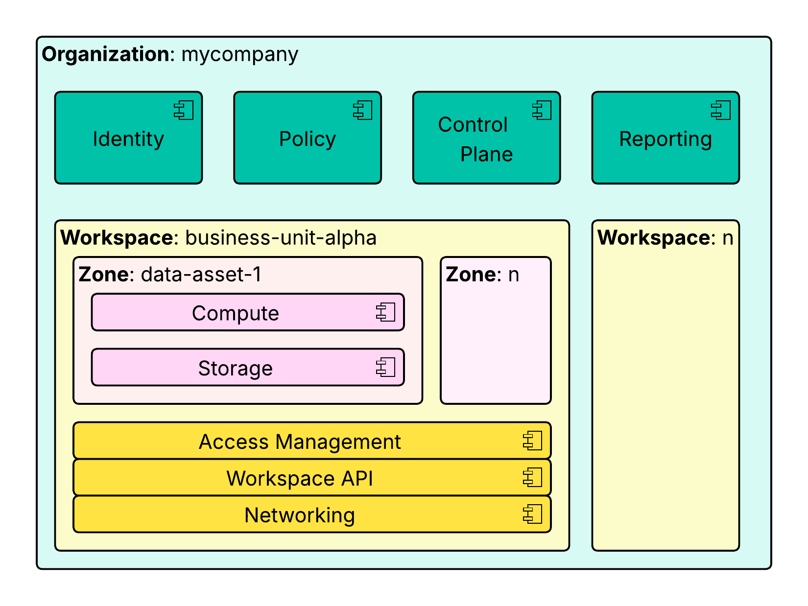

# Organization

Organizations in Entigo Platform provide centralized management and governance capabilities. Organizations enable platform teams to define company-specific platform configurations and policies while providing the means for centralized [Workspace](workspace) management.

Organizations form the foundation of Entigo Platform's multi-tenancy architecture, providing isolation between companies or independent business units within a single company. Organizations support:

**Central identity management**: Federate authentication with your corporate SAML provider and manage user access across all [Workspaces](workspace) from a single control point.

**Policies**: Set rules and define platform default behaviors that align with your organization's needs and compliance requirements.

**Control Plane**: Central Workspace orchestration enables you to simplify user experience and improve compliance with standardized [workspace](workspace) configurations that can be deployed and operated consistently across your organization. The control plane provides centralized management for workspace provisioning, configuration updates, and policy enforcement.

**Reporting**: Gain comprehensive visibility into platform operations and usage patterns. Reporting capabilities span areas such as FinOps and cost management, vulnerability compliance tracking, and much more, enabling data-driven decision-making across your organization.

In addition to organization level isolation, Entigo Platform enables security isolation at:
- [Workspace](workspace) level, backed by dedicated [data plane](control-data-plane) services
- [Zone](zone) level, enabling cost-effective logical isolation within a [Workspaces](workspace).
