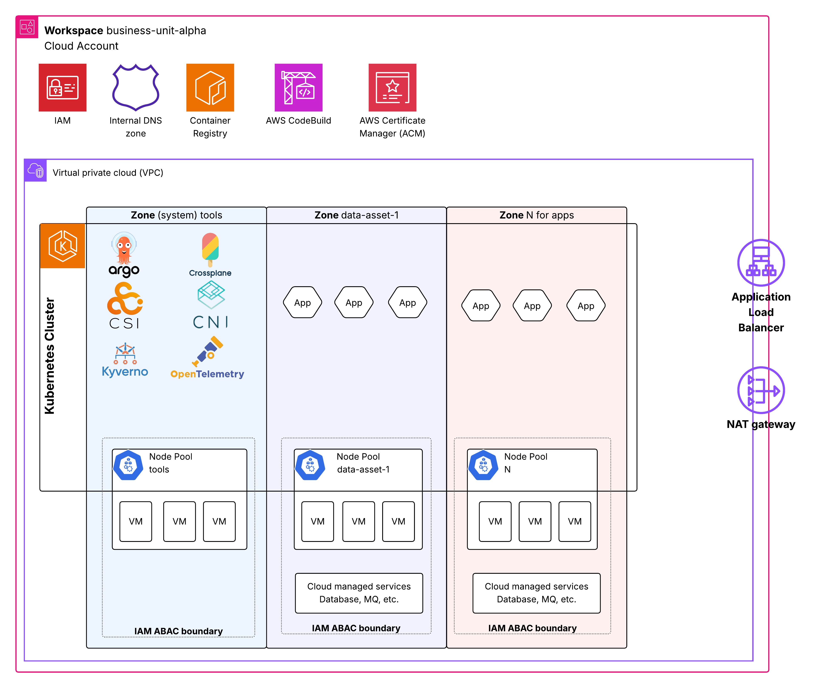

# Workspace

A workspace is where your applications reside. Workspaces include functionality and resources to provide an isolated and independent [data plane](data-control-plane) instance for your workloads. They are built on cloud-provider native constructs such as dedicated account, VPC, IAM, and Kubernetes cluster to implement strong isolation from other workspaces at the cloud provider level.

Workspaces are designed to be self-contained, with minimal external dependencies. To achieve this goal, each workspace includes all components necessary to continue operating and self-heal even if external services temporarily unavailable:

- **AWS Account and IAM**: Provides strong isolation for resources and access management. All roles and privileges are defined within the workspace and cannot span multiple workspaces, even in the event of configuration errors.

- **AWS CodeBuild**: Runs workspace deployment and configuration tasks, enabling workspaces to operate independently without the central [Organization](organization) and recover from issues when organization tools are unavailable.

- **Networking infrastructure**: Each workspace has a dedicated local DNS zone, Certificate Manager for secure TLS certificate management, and Application Load Balancers to expose applications to internal and external users.

- **Internet and corporate connectivity**: Depending on configuration, workspaces may have a dedicated NAT Gateway for internet access or connect to the corporate network through Transit Gateway.

- **EKS Kubernetes cluster**: Provides a workspace-local control plane that manages infrastructure and orchestrates resource provisioning.

- **ECR container registry**: Maintains a local copy of all container images used by the workspace. Storing your application images in the same registry ensures deployment resilience even when central build and artifact storage solutions are down.

- **Platform tooling**: Each workspace includes a dedicated deployment of tools that enable Kubernetes-based APIs to integrate with AWS APIs. These tools are deployed to a dedicated [Zone](zone) and node pool.

While this approach provides a robust foundation for high availability and strong isolation for data confidentiality, it incurs costs. Each of these dedicated services contributes to the workspace base cost, roughly $200-400 per month for a workspace.

For teams that don't require strong isolation between all data assets and cannot justify a dedicated workspace for each asset, [Zones](zone) provide a mechanism for logical isolation between data assets within a single workspace.

