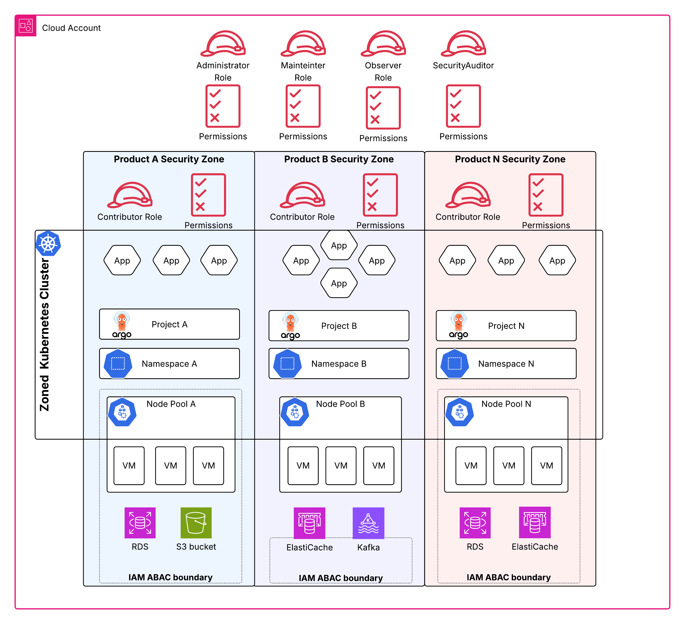

# Zone

Zones are a fundamental building block of Entigo Platform's security architecture. They enable security isolation between different information assets and systems within a [Workspace](workspace). Zones offer a cost-effective alternative to dedicated [Workspaces](workspace) when you need to separate data assets that share similar security requirements and controls. By consolidating multiple zones into a single [Workspace](workspace), you reduce infrastructure redundancy while maintaining appropriate security boundaries for your workloads.

## What is a Zone?
A Zone is an opinionated abstraction that combines access management, compute resource orchestration, and policy enforcement to provide isolation between different data assets. Zones deliver two primary forms of isolation:

- **Compute resource isolation**: Separate VM pools for different data assets reduce noisy neighbor effects and limit lateral movement risks.
- **Authorization isolation**: Control plane access segregation ensures data asset owners can only manage their own resources, enforcing the principle of least privilege.

### How Zones Work
Zones implement isolation through multiple platform mechanisms:

#### AWS IAM Attribute Based Access Control (ABAC)
All zoned resources are tagged with the zone identifier. AWS IAM policies use this identifier to restrict operations to resources within the user's current zone. For example, if a database is deployed to Zone A, IAM policies prevent it from being manipulated from Zone B. 

#### Kubernetes Namespaces 
Each zone is associated with one or more Kubernetes namespaces. Resources are accessed through these namespaces, and the namespace you deploy to determines the resource's zone association. All zone-specific metadata is applied automatically. 

#### Kubernetes Role Based Access Control (RBAC)
User access to Kubernetes is restricted to namespaces within their authorized zones. 

#### Node Pools
Each zone has one or more node pools. Workloads deployed to a zone are automatically scheduled to the zone's default node pool. Users can specify an alternative node pool within the zone when needed-for, for example, to deploy workloads on Spot instances. 

#### Autoscaling
All zone node pools are backed by autoscaling mechanisms. You can configure autoscaling behavior for each pool, including resource limits (minimum and maximum instances, instance types), availability zones, and purchase models (on-demand or spot). The autoscaler works in conjunction with Kubernetes workload resource requests: when capacity is insufficient, new nodes are added; when resources are no longer needed, redundant nodes are terminated. 

#### Network Policies
By default, network connectivity between workloads in different zones is blocked. Users can explicitly allow connectivity if authorized by organizational policy and the zone owner.

#### Policy Enforcement
Kubernetes-based policy enforcement ensures all workloads are scheduled to node pools associated with their zone. While users may specify alternative node pools within their zone, policy enforcement prevents scheduling workloads to node pools outside the zone. 

#### ArgoCD Projects
If your organization uses [ArgoCD for GitOps](../gitops/intro.md), zones are automatically associated with ArgoCD projects, and zone access management extends to include ArgoCD access control.

## When to Use Zones
Every Entigo Platform instance is zoned and comes with a pre-configured default zone. You can add additional zones when you want to deploy multiple data assets on a shared platform instance and enforce access and resource isolation between the assets.

Use zones to isolate data assets within a single platform instance when:

- Assets have similar security and compliance requirements
- Extra costs for dedicated platform instances for each data asset are not justified
- Teams require independent resource management within shared infrastructure

Use cloud provider level isolation instead when:

- Assets have fundamentally different security requirements and control implementations
- Regulatory compliance mandates complete infrastructure separation
- Blast radius containment is critical for high-value assets
- Different organizational units need platform instance level autonomy and cannot work within zone boundaries

## Create a Zone
To add a zone to your platform instance define your zone configuration using the [Zone.tenancy.entigo.com](/api/Zone) API.

For detailed examples and configuration options, see the examples tab in the zone API reference.
