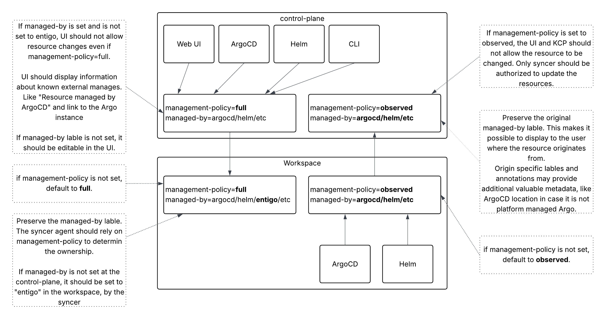

# ADR: Resource Ownership Tracking with `app.kubernetes.io/managed-by` Label

**Status:** Proposed  
**Date:** 2026-01-19  
**Decision Makers:** Entigo RnD Team

## Context

Entigo Platform manages Kubernetes resources across two layers:

1. **Control Plane** - Where resources are defined in isolated kubernetes API compatible virtual workspaces
2. **Physical Cluster (Workspace)** - Where resources are deployed and run

We already use the `entigo.io/management-policy` label to distinguish between:
- `full` - Resources created at the control plane and synced down to the workspace
- `observed` - Resources created directly in the workspace and synced up to the control plane for visibility

However, `management-policy` alone does not answer the question: **"Who created this resource and where can it be edited?"**

### Problem Statement

We need to track resource ownership to enforce editability rules:

| Scenario | Should Web UI allow editing? |
|----------|------------------------------|
| Resource created via Web UI | Yes |
| Resource created via ArgoCD at control plane | No - managed externally |
| Resource created via Helm in workspace (observed) | No - workspace is source of truth |
| Resource created via CLI/API | Depends on policy |

Additionally, customers evaluating Entigo Platform in parallel with existing tools (ArgoCD, Flux, Helm) need their tool-specific metadata preserved to enable easy migration back if needed.

## Decision

We will use the standard Kubernetes label `app.kubernetes.io/managed-by` in combination with `entigo.io/management-policy` to track resource ownership across both dimensions:

### Label Semantics

| Label | Purpose | Set By |
|-------|---------|--------|
| `entigo.io/management-policy` | Defines sync direction and source of truth | Platform |
| `app.kubernetes.io/managed-by` | Identifies the tool/interface that created the resource | Creating tool |

### Behavior by Layer

**Control Plane (for `policy: full` resources):**
- `managed-by` reflects the originator: `argocd`, `helm`, `entigo-web`
- lable should be created by the client application, not by mutation webhook or similar. 
- Used to determine editability in the Web UI - implemented by [Resource Origin Policy](resource-origin-policy)

**Control Plane (for `policy: observed` resources):**
- `managed-by` is preserved from the workspace (e.g., `Helm`, `argocd`)
- Resources are read-only at control plane - implemented by [Resource Origin Policy](resource-origin-policy)

**Workspace/Physical Cluster:**
- `managed-by` is preserved as-is (not overwritten by syncer)
- Platform relies on `management-policy: full` to assert ownership
- local changes my be evaluated and blocker based on [Resource Origin Policy](resource-origin-policy)



### Editability Rules

This is an example of the logic. Logic itself should be customizable for each organisation and workspace with default managed rules provided by the platform. 

```
Control Plane:
  if management-policy == "observed":
    editable = false  # Source of truth is workspace
  else if management-policy == "full":
    editable = (managed-by in ["web-ui", "api", "cli", ""])
    
Workspace:
  if management-policy == "full":
    # Syncer owns this resource, do not modify directly
  if management-policy == "observed":
    # Original tool (Helm/ArgoCD/etc) owns this resource
```

## Alternatives Considered

### Alternative 1: Overwrite `managed-by` to `entigo-platform` on Sync

**Approach:** When syncing `policy: full` resources from control plane to workspace, overwrite the `managed-by` label to `entigo-platform`.

**Pros:**
- Semantically correct - the syncer is the active manager at workspace level
- Clear ownership signal for cluster-level tooling

**Cons:**
- Loses provenance information (who originally created it)
- Breaks compatibility for customers evaluating platform alongside existing tools
- Tools like Helm may conflict if they expect to see their own label
- Requires storing original value in annotation for traceability

**Decision:** Rejected - the downside of losing tool compatibility during evaluation outweighs the semantic purity.

### Alternative 2: Use Only `management-policy`, Ignore `managed-by`

**Approach:** Rely solely on `entigo.io/management-policy` for all ownership decisions.

**Pros:**
- Simpler - single label for all decisions
- No dependency on external tool behavior

**Cons:**
- Cannot distinguish between Web UI and ArgoCD-created resources at control plane
- Cannot show users which external tool manages a resource
- Cannot generate links to external systems (ArgoCD UI, etc.)

**Decision:** Rejected - we need finer-grained ownership tracking at control plane level.

### Alternative 3: Introduce a Platform-Specific Origin Label

**Approach:** Create a new label like `entigo.io/created-by` instead of using the standard `managed-by`.

**Pros:**
- Full control over semantics
- No conflict with existing tooling

**Cons:**
- Duplicates standard Kubernetes convention
- External tools don't understand it
- Adds yet another label to manage

**Decision:** Rejected - better to follow Kubernetes conventions where possible.

### Alternative 4: Store Origin in Annotation Instead of Label

**Approach:** Use an annotation like `platform.entigo.io/origin` for tracking creator.

**Pros:**
- Annotations can hold richer data (timestamps, URLs)
- No conflict with label selectors

**Cons:**
- Cannot filter/select resources by origin
- Less visible in standard tooling
- Splits ownership metadata across labels and annotations

**Decision:** Partially adopted - we use annotations for supplementary metadata (external manager URLs) but keep `managed-by` as the primary ownership indicator.

## Consequences

### Positive

1. **Follows Kubernetes conventions** - Uses standard `app.kubernetes.io/managed-by` label
2. **Preserves tool compatibility** - Customers can migrate off platform without losing tool metadata
3. **Enables rich UI** - Can show "Managed by ArgoCD" with link to ArgoCD instance
4. **Clear separation of concerns** - `management-policy` for sync direction, `managed-by` for ownership
5. **Consistent enforcement** - Same policies work for Web UI (via kyverno-json) and CLI (via admission webhook)

### Negative

1. **Two labels to understand** - Operators must understand the relationship between both labels
2. **Relies on external tools setting `managed-by`** - Some tools may not set this label
3. **No automatic ownership transfer** - If a resource moves from ArgoCD to Web UI management, label must be manually updated

### Neutral

1. **Syncer does not modify `managed-by`** - This is intentional to preserve tool compatibility
2. **`managed-by` at workspace level may not reflect syncer** - Acceptable because `management-policy: full` indicates platform ownership

## Implementation Notes

### External Manager Detection

The platform should recognize common `managed-by` values and extract additional metadata:

| `managed-by` Value | Additional Annotations to Check | UI Display |
|--------------------|--------------------------------|------------|
| `argocd` | `argocd.argoproj.io/instance` | Link to ArgoCD app |
| `Helm` | `meta.helm.sh/release-name` | Show release info |
| `Flux` | `kustomize.toolkit.fluxcd.io/name` | Link to Flux resource |
| `kustomize` | - | Show "Managed by Kustomize" |

### Default Values

- Resources created by Web UI should be labled wiht `app.kubernetes.io/managed-by=entigo-web`
- if no `managed by` lable is set by the client application, backend should not set it either. 

## References

- [Kubernetes Recommended Labels](https://kubernetes.io/docs/concepts/overview/working-with-objects/common-labels/)
- [Helm Labels and Annotations](https://helm.sh/docs/chart_best_practices/labels/)
- [ArgoCD Resource Tracking](https://argo-cd.readthedocs.io/en/stable/user-guide/resource_tracking/)