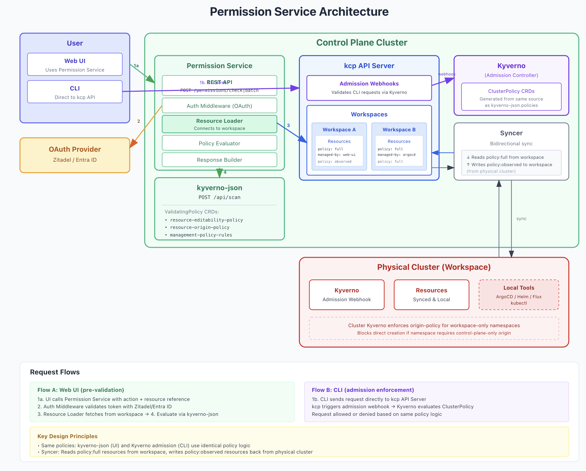

# ADR: Resource Origin Policy

**Status:** Draft  
**Date:** 2026-01-19  
**Decision Makers:** Entigo RnD Team

## Context

The Entigo platform supports bidirectional resource synchronisation between a control plane and workspace clusters. Resources can originate from multiple sources:

- **Control plane**: Web UI, CLI, API or external application like ArgoCD creating resources that sync to workspaces
- **Workspace**: GitOps tools (ArgoCD, Flux, Helm) creating resources that sync back as "observed" resources

Different customers have different operational models:

1. **Platform-centric**: All resources must be created through the control plane for governance and audit. Direct workspace deployments are prohibited.
2. **GitOps-centric**: The platform provides cluster management and visibility only. Resources are created via workspace-local ArgoCD/Flux and synced back for observability.
3. **Mixed**: Both origins are permitted, with visibility and tracking across both.

Without explicit policy, there's no enforcement of these operational boundaries. Users could bypass intended workflows, creating compliance and governance gaps.

### Problem Statement

The platform needs a mechanism to:
1. Declare where resource creation is permitted (control plane, workspace, or both)
2. Enforce these rules at admission time in both locations
3. Provide permission checks for the Web UI before users attempt operations
4. Apply rules at workspace, zone or namespace granularity
5. Allow exceptions for platform-managed infrastructure components

## Decision

Implement **Resource Origin Policy** as a custom CRD with Kyverno as the enforcement backend, augmented by kyverno-json for Web UI permission checks.

### Policy Model

TODO: this needs fruther discussion, this is just an autogenerated example. 

```yaml
apiVersion: policy.entigo.com/v1alpha1
kind: ResourceOriginPolicy
metadata:
  name: production-namespaces
spec:
  namespaceSelector:
    matchLabels:
      environment: production
  
  allowedOrigins: control-plane-only  # control-plane-only | workspace-only | any
  
  allowedSubjects:
    controlPlane:
      - kind: ServiceAccount
        name: entigo-syncer
        namespace: entigo-system
    workspace:
      - kind: ServiceAccount
        name: flux-controller
        namespace: flux-system
      - kind: ServiceAccount
        name: argocd-application-controller
        namespace: argocd
  
  exceptions:
    - managedBy: entigo-platform
    - namespaces:
        - entigo-system
        - kube-system
```

### Policy Values

TODO: this needs fruther discussion, this is just an autogenerated example. 

| Policy Value | Control Plane Creation | Workspace Creation | Use Case |
|--------------|------------------------|-------------------|----------|
| `control-plane-only` | ✓ Allowed | ✗ Blocked | Full platform control, compliance-heavy environments |
| `workspace-only` | ✗ Blocked | ✓ Allowed | Platform for visibility, ArgoCD/Helm for deployment |
| `any` | ✓ Allowed | ✓ Allowed | Flexible, evaluation, mixed workflows |

### Architecture



### Enforcement Flow

**At workspace (cluster admission):**

```
if namespace.originPolicy == "control-plane-only":
    if request.operation == CREATE:
        if request.userInfo != "system:serviceaccount:entigo-system:syncer":
            deny("Resources in this namespace must be created via control plane")
    if request.operation == UPDATE:
        if resource.labels["management-policy"] == "full":
            if request.userInfo != "system:serviceaccount:entigo-system:syncer":
                deny("Platform-managed resources can only be modified via control plane")
```

**At control plane:**

```
if namespace.originPolicy == "workspace-only":
    if request.operation == CREATE:
        deny("Resources in this namespace must be created via workspace tooling")
```

## Alternatives Considered

### Alternative 1: Kubernetes RBAC Only

Use standard RBAC to restrict which service accounts can create resources.

```yaml
apiVersion: rbac.authorization.k8s.io/v1
kind: RoleBinding
metadata:
  name: gitops-only
  namespace: production
subjects:
  - kind: ServiceAccount
    name: flux-controller
    namespace: flux-system
roleRef:
  kind: Role
  name: resource-creator
```

**Pros:**
- Native Kubernetes, no additional components
- Well-understood by operators

**Cons:**
- Static and doesn't support per-namespace policy configuration
- Requires manual RoleBinding management for each namespace
- Cannot enforce "control-plane-only" semantics (RBAC doesn't know about sync direction)
- No integration with Web UI for permission checks

**Rejection reason:** RBAC lacks the dynamic, declarative configuration needed for namespace-level policy and cannot distinguish between sync sources.

### Alternative 2: Custom Admission Webhook

Build a standalone admission webhook with a dedicated REST API for permission checks.

**Pros:**
- Full control over logic and response format
- Single codebase for enforcement and UI checks
- Can include rich metadata (external manager links)

**Cons:**
- Significant development and maintenance burden
- Reinventing policy evaluation logic
- No ecosystem tooling or community support
- Testing and debugging more complex

**Rejection reason:** Building custom admission infrastructure is a maintenance burden when proven tools exist.

### Alternative 3: Gatekeeper/OPA

Use Open Policy Agent with Gatekeeper for policy enforcement.

**Pros:**
- Powerful policy language (Rego)
- Widely adopted in the ecosystem
- Good audit capabilities

**Cons:**
- Steeper learning curve for Rego
- No built-in mechanism for Web UI permission checks
- Requires separate solution for REST API integration
- More complex operational model

**Rejection reason:** Rego's learning curve and lack of REST API for pre-flight checks makes Kyverno a better fit.

### Alternative 4: ValidatingAdmissionPolicy (Kubernetes Native CEL)

Use Kubernetes 1.30+ native CEL-based validation.

```yaml
apiVersion: admissionregistration.k8s.io/v1
kind: ValidatingAdmissionPolicy
metadata:
  name: control-plane-only
spec:
  matchConstraints:
    resourceRules:
      - apiGroups: ["*"]
        apiVersions: ["*"]
        resources: ["*"]
  validations:
    - expression: "request.userInfo.username.startsWith('system:serviceaccount:entigo-system:')"
      message: "Resources must be created via control plane"
```

**Pros:**
- No external dependencies
- Native to Kubernetes
- CEL is performant

**Cons:**
- Requires Kubernetes 1.30+ (limiting for some customers)
- Limited policy complexity compared to Kyverno
- No Web UI integration for permission checks
- Cannot generate policies from higher-level CRD

**Rejection reason:** Version requirement limits customer adoption, and lack of REST API for UI integration is a significant gap.

## Why Kyverno with kyverno-json

### Dual Enforcement Model

Kyverno provides proven admission webhook enforcement, while kyverno-json provides REST API evaluation using the same policy language:

| Requirement | Kyverno | kyverno-json | Combined |
|-------------|---------|--------------|----------|
| Admission enforcement | ✓ Native | - | ✓ |
| REST API for UI checks | - | ✓ `/api/scan` | ✓ |
| Same policy language | ✓ | ✓ | ✓ Single source of truth |
| Rich response metadata | Limited | Configurable | ✓ |
| Batch permission queries | - | ✓ | ✓ |

### Policy Generation

A controller watches `ResourceOriginPolicy` CRD and generates:
- `ValidatingPolicy` for kyverno-json (control plane permission checks)
- `ClusterPolicy` for Kyverno (workspace admission enforcement)

This provides a single source of truth with platform-specific abstractions.

### Generated Kyverno Policy Example

```yaml
apiVersion: kyverno.io/v1
kind: ClusterPolicy
metadata:
  name: production-origin-policy
  labels:
    platform.entigo.io/generated-from: production-policy
spec:
  validationFailureAction: Enforce
  rules:
    - name: control-plane-only
      match:
        any:
          - resources:
              kinds: ["*"]
              namespaceSelector:
                matchLabels:
                  environment: production
      exclude:
        any:
          - subjects:
              - kind: ServiceAccount
                name: entigo-syncer
                namespace: entigo-system
      validate:
        message: "Resources in production namespaces must originate from control plane"
        deny:
          conditions:
            any:
              - key: "{{ request.object.metadata.labels.\"entigo.io/management-policy\" || '' }}"
                operator: NotEquals
                value: "full"
```

## Consequences

### Positive

1. **Declarative policy configuration** — Operators define intent, platform generates enforcement
2. **Consistent enforcement** — Same policies work for Web UI (via kyverno-json) and CLI/GitOps (via admission webhook)
3. **Namespace-level granularity** — Policies can vary by namespace or namespace group
4. **Extensible** — Can add new policy types without changing enforcement infrastructure
5. **Ecosystem alignment** — Kyverno is widely adopted and well-documented

### Negative

1. **Additional component** — Kyverno must be deployed to workspace clusters
2. **Policy sync required** — ClusterPolicy resources must sync from control plane to workspaces
3. **Two policy formats** — ValidatingPolicy (kyverno-json) and ClusterPolicy (Kyverno) have slightly different schemas

### Neutral

1. **kyverno-json maturity** — Project shows "early development" warning; evaluate stability for production
2. **Learning curve** — Teams must understand Kyverno policy language

## Implementation Notes

### Web UI Permission API

TODO: this needs fruther discussion, this is just an autogenerated example. 


```
GET /api/v1/namespaces/{namespace}/permissions
```

```json
{
  "namespace": "prod-app-a",
  "originPolicy": "control-plane-only",
  "canCreateResources": true,
  "canCreateVia": ["web-ui", "api", "cli"]
}
```

```
GET /api/v1/namespaces/{namespace}/resources/{group}/{kind}/{name}/permissions
```

```json
{
  "resource": {
    "namespace": "prod-app-a",
    "group": "apps",
    "kind": "Deployment",
    "name": "my-app"
  },
  "managementPolicy": "observed",
  "managedBy": "argocd",
  "canEdit": false,
  "canDelete": false,
  "reason": "Resource is managed by ArgoCD",
  "externalManager": {
    "type": "argocd",
    "instance": "prod-argocd",
    "url": "https://argocd.example.com/applications/my-app"
  }
}
```

### Relationship to management-policy Label

Resource Origin Policy works alongside the existing `management-policy` label:

- **`management-policy`** answers: "What is the sync direction / source of truth?"
- **Resource Origin Policy** answers: "Where is resource creation permitted?"

Both are needed because:
- A `policy: full` resource could be created by Web UI (editable) or synced from workspace ArgoCD (not editable through platform)
- A `policy: observed` resource originates from the workspace but may or may not be allowed depending on origin policy

### Platform Exceptions

Platform infrastructure must always be deployable regardless of origin policy:

```yaml
spec:
  exceptions:
    - managedBy: entigo-platform
    - namespaces:
        - entigo-system
        - kube-system
```

## References

- [Kyverno Documentation](https://kyverno.io/docs/)
- [kyverno-json Project](https://kyverno.github.io/kyverno-json/latest/)
- [Kubernetes Recommended Labels](https://kubernetes.io/docs/concepts/overview/working-with-objects/common-labels/)
- [Entigo Managed By Lable](managed-by)
