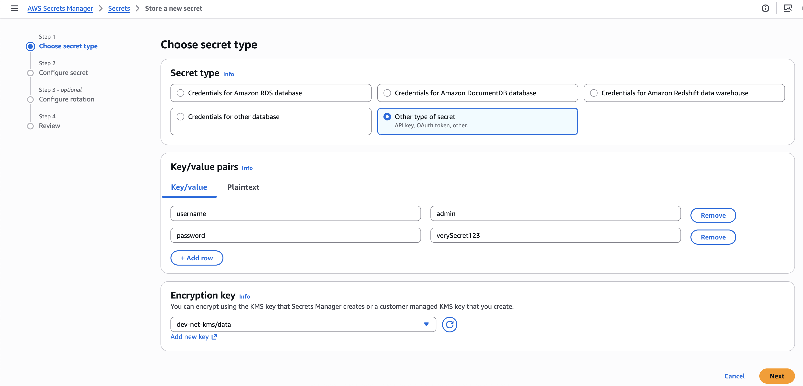
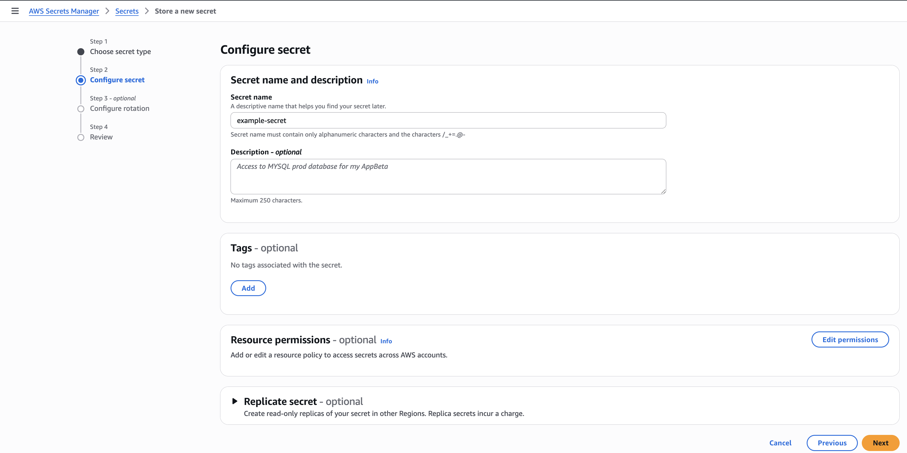
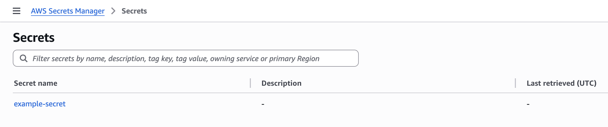

# Create a secret

This is an example of how to create a secret in AWS Secrets Manager and access it in a Kubernetes cluster using External Secrets.

It is a good practice to encrypt secrets using kms/data key which is created by the Infralib KMS module.

For more information about AWS Secrets Manager, see [AWS Secrets Manager User Guide](https://docs.aws.amazon.com/secretsmanager/latest/userguide/create_secret.html).

For more information about External Secrets, see [External Secrets User Guide](https://external-secrets.io/latest/guides/introduction/).

For more information about Secrets in Kubernetes, see [Kubernetes documentation](https://kubernetes.io/docs/concepts/configuration/secret/).

## Create a secret in AWS Secrets Manager using AWS Console

```
# Example secret data
username=admin
password=verySecret123
```

`Secrets Manager` -> `Store a new secret`

Select `Other type of secret`

Fill `Key/value pairs` and choose `Encryption key`.

It is recommended to use `kms/data` key created by the Infralib KMS module.

Click `Next`



Set desired `Secret name`

Click `Next`



Verify secret exists in AWS Secrets Manager.



## Create a secret in AWS Secrets Manager using AWS CLI

```bash
aws secretsmanager create-secret \
 --name example-secret \
 --secret-string '{"username":"admin","password":"verySecret123"}' \
 --kms-key-id alias/dev-net-kms/data
```

## Access a secret in a Kubernetes cluster with External Secrets

Create an External Secret manifest. It is a good practice to include it in the application's Helm chart.

```yaml
# Example External Secret manifest
apiVersion: external-secrets.io/v1
kind: ExternalSecret
metadata:
  name: example-secret
  annotations:
    argocd.argoproj.io/sync-wave: '-2'
spec:
  refreshInterval: 5m
  dataFrom:
    - extract:
        key: example-secret # AWS Secrets Manager secret
  secretStoreRef:
    kind: ClusterSecretStore
    name: external-secrets
  target:
    name: example-secret # Kubernetes secret to create
    creationPolicy: Owner
```

Secret created by External Secrets in Kubernetes

```
$ kubectl get secret
NAME             TYPE     DATA   AGE
example-secret   Opaque   1      10d
```

External Secret and Secret in ArgoCD

TODO

### Mounting a secret to a container

```yaml
apiVersion: apps/v1
kind: Deployment
metadata:
  name: nginx
  labels:
    app: nginx
spec:
  replicas: 1
  selector:
    matchLabels:
      app: nginx
  template:
    metadata:
      labels:
        app: nginx
    spec:
      containers:
        - name: nginx
          image: nginx:latest
          ports:
            - containerPort: 80
          envFrom:
            - secretRef:
                name: example-secret
```

### 5. Result

TODO
