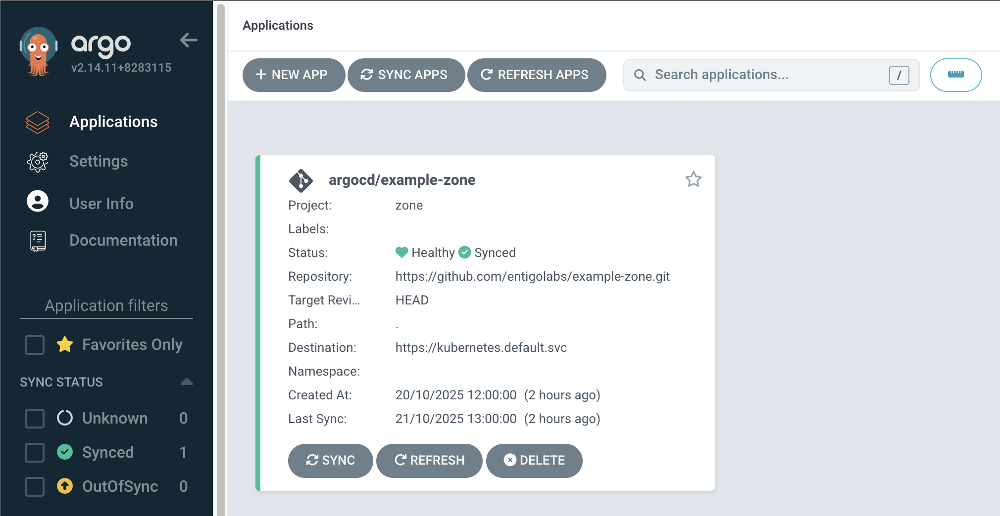

# Create a zone

This is an example of how to create a zone.

It is a good practice to manage zones using GitOps methodology, similar to how applications are deployed.
For better organization, consider creating a dedicated git repository and ArgoCD project specifically for zones.

## Requirements

Git repository with the zone manifest.

```yaml
# Example zone
apiVersion: tenancy.entigo.com/v1alpha1
kind: Zone
metadata:
  name: example-zone
spec:
  appProject:
    contributorGroups:
      - 123456789-1234-1234-1234-123456789 # AWS IAM Group ID
  namespaces:
    # Kubernetes namespaces in this zone
    - name: example-namespace
  pools:
    - name: default
      requirements:
        - key: instance-type
          values:
            - t3.large
        - key: capacity-type
          value: ON_DEMAND
        - key: min-size
          value: 1
        - key: max-size
          value: 2
```

## Deployment

### 1. Create read-only token in GitLab

`Settings` -> `Access Tokens` -> `Add new token`

Add token name: `argocd-read-token`

Select `Expiration date`

Select `read_repository` scope

Click `Create project access token`

Refer to GitLab [documentation](https://docs.gitlab.com/user/profile/personal_access_tokens/#create-a-personal-access-token) for more information.

### 2. Connect repository in ArgoCD

`Settings` -> `Repositories` -> `Connect repo`

Choose your connection method: `VIA HTTPS`

Type: `git`

Name: `example-zone`

Project: `zone`

Repository URL: `<repository-url-that-contains-the-zone-manifest>`

Username: `argocd-read-token`

Password: `<argocd-read-token-password>`

Click `Connect`

Refer to ArgoCD [documentation](https://argo-cd.readthedocs.io/en/latest/user-guide/private-repositories/#private-repositories) for more information.

### 3. Create new ArgoCD application in ArgoCD

`Applications` -> `+ NEW APP`

Application name: `example-zone`

Project Name: `zone`

Source -> Repository URL: `<repository-url-that-contains-the-zone-manifest>`

Source -> Revision: `HEAD`

Source -> Path: `.`

Destination -> Cluster URL: `https://kubernetes.default.svc`

Click `Create`

Refer to ArgoCD [documentation](https://argo-cd.readthedocs.io/en/stable/getting_started/#creating-apps-via-ui) for more information.

### 4. Sync ArgoCD application

`Applications` -> `example-zone`

Click `Refresh` and `Sync`

### 5. Result


