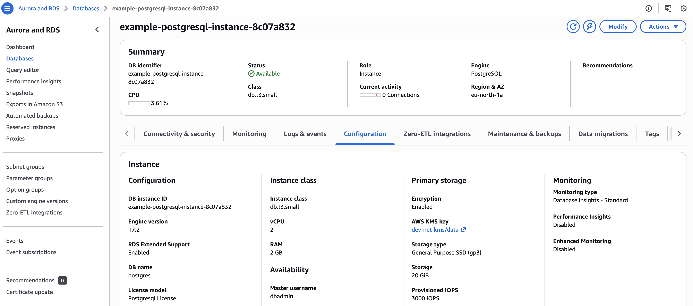
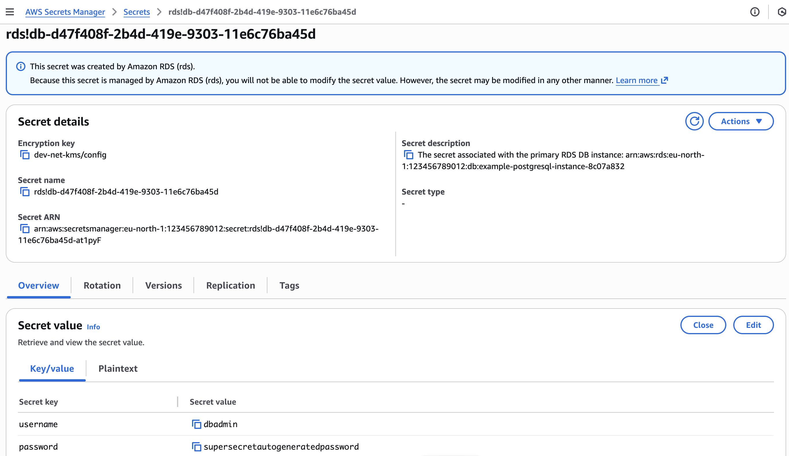

# Create a PostgreSQL Instance

This is an example of how to create a PostgreSQLInstance, PostgreSQLUser and PostgreSQLDatabase.

## 1. Create Kubernetes manifests for PostgreSQLInstance, PostgreSQLUser and PostgreSQLDatabase

Create manifests and deploy them to the cluster. It is a good practice to include it in the application's Helm chart.

Security group and security group rules which allow access to the PostgreSQLInstance from pods are created automatically.

```yaml
# Example PostgreSQLInstance
apiVersion: database.entigo.com/v1alpha1
kind: PostgreSQLInstance
metadata:
  name: example-postgresql
spec:
  allocatedStorage: 20
  engineVersion: '17.2'
  instanceType: 'db.t3.small'

---
# Example PostgreSQLInstance with custom settings
apiVersion: database.entigo.com/v1alpha1
kind: PostgreSQLInstance
metadata:
  name: example-postgresql
spec:
  allocatedStorage: 20
  engineVersion: '17.2'
  instanceType: 'db.t3.small'
  iops: 3000
  multiAZ: true
  parameterGroupName: 'default.postgres17'
  deletionProtection: true
  autoMinorVersionUpgrade: true
  allowMajorVersionUpgrade: false
  backupWindow: '05:00-05:00'
  maintenanceWindow: 'Mon:00:00-Mon:03:00'

---
# Example PostgreSQLUser
apiVersion: database.entigo.com/v1alpha1
kind: PostgreSQLUser
metadata:
  name: example-user
spec:
  instanceRef:
    name: example-postgresql

---
# Example PostgreSQLUser with custom settings
apiVersion: database.entigo.com/v1alpha1
kind: PostgreSQLUser
metadata:
  name: example-user
spec:
  instanceRef:
    name: example-postgresql
  createDb: true
  createRole: true
  inherit: false
  login: true

---
# Example PostgreSQLDatabase
apiVersion: database.entigo.com/v1alpha1
kind: PostgreSQLDatabase
metadata:
  name: example-database
spec:
  owner: example-user
  instanceRef:
    name: example-postgresql

---
# Example PostgreSQLDatabase with custom settings
apiVersion: database.entigo.com/v1alpha1
kind: PostgreSQLDatabase
metadata:
  name: example-database
spec:
  owner: example-user
  instanceRef:
    name: example-postgresql
  extensions:
    - postgis
```

## 2. Mount connection credentials to a container

Connection credentials for the master user `dbadmin` are stored in a Kubernetes secret `<.metadata.name>-dbadmin` and AWS Secrets Manager secret.

Connection credentials for additional users created with `PostgreSQLUser` manifest are stored in a Kubernetes secret `<.spec.instanceRef.name>-<.metadata.name>`.

For more information about Secrets in Kubernetes, see [Kubernetes documentation](https://kubernetes.io/docs/concepts/configuration/secret/).

```yaml
# Example
apiVersion: v1
kind: Pod
metadata:
  name: postgres
spec:
  containers:
    - name: postgres
      image: postgres:alpine
      command: ['sleep', 'infinity']
      env:
        - name: PGHOST
          valueFrom:
            secretKeyRef:
              name: example-postgresql-example-user
              key: endpoint
        - name: PGPORT
          valueFrom:
            secretKeyRef:
              name: example-postgresql-example-user
              key: port
        - name: PGUSER
          valueFrom:
            secretKeyRef:
              name: example-postgresql-example-user
              key: username
        - name: PGPASSWORD
          valueFrom:
            secretKeyRef:
              name: example-postgresql-example-user
              key: password
        - name: PGSSLMODE
          value: 'require'
```

## 3. Result

### 3.1 PostgreSQLInstance, PostgreSQLUser and PostgreSQLDatabase

PostgreSQLInstance, PostgreSQLUser and PostgreSQLDatabase created in Kubernetes

```yaml
$ kubectl get pginstances.database.entigo.com
NAME                 SYNCED   READY   COMPOSITION                       AGE
example-postgresql   True     True    pginstances.database.entigo.com   52m

$ kubectl get postgresqlusers.database.entigo.com
NAME           SYNCED   READY   COMPOSITION                           AGE
example-user   True     False   postgresqlusers.database.entigo.com   20m

$ kubectl get postgresqldatabases.database.entigo.com
NAME               SYNCED   READY   COMPOSITION                               AGE
example-database   True     True    postgresqldatabases.database.entigo.com   16m
```

PostgreSQLInstance instance created in AWS Console



### 3.2 Secrets with connection credentials in Kubernetes and AWS Secrets Manager

Kubernetes secrets with connection credentials

```yaml
$ kubectl get secret
NAME                              TYPE                                DATA   AGE
example-postgresql-dbadmin        Opaque                              4      52m
example-postgresql-example-user   connection.crossplane.io/v1alpha1   4      20m

$ kubectl get secret example-postgresql-dbadmin -o yaml
apiVersion: v1
kind: Secret
metadata:
  name: example-postgresql-dbadmin
  namespace: <namespace>
type: Opaque
data:
  endpoint: <base64-encoded-endpoint>
  port: <base64-encoded-port>
  username: <base64-encoded-username>
  password: <base64-encoded-password>

$ kubectl get secret example-postgresql-example-user -o yaml
apiVersion: v1
kind: Secret
metadata:
  name: example-postgresql-example-user
  namespace: <namespace>
type: Opaque
data:
  endpoint: <base64-encoded-endpoint>
  port: <base64-encoded-port>
  username: <base64-encoded-username>
  password: <base64-encoded-password>
```

AWS Secrets Manager secret with connection credentials for `dbadmin` user.



### 3.3 Secrets mounted to a container

```bash
# Example
$ kubectl get pod
NAME       READY   STATUS    RESTARTS   AGE
postgres   1/1     Running   0          24s

$ kubectl exec -it postgres -- bash
postgres:/# env
PGPORT=5432
PGPASSWORD=supersecretautogeneratedpassword
PGSSLMODE=require
PGUSER=example-user
PGHOST=example-postgresql-instance-8c07a832.abc123.eu-north-1.rds.amazonaws.com

postgres:/# psql example-database
psql (18.1, server 17.2)
SSL connection (protocol: TLSv1.3, cipher: TLS_AES_256_GCM_SHA384, compression: off, ALPN: postgresql)
Type "help" for help.

example-database=> \du
                                List of roles
    Role name    |                         Attributes
-----------------+------------------------------------------------------------
 dbadmin         | Create role, Create DB                                    +
                 | Password valid until infinity
 example-user    | No inheritance, Create role, Create DB
...

example-database=> \l
                                                           List of databases
       Name       |    Owner     | Encoding | Locale Provider |   Collate   |    Ctype    | Locale | ICU Rules |   Access privileges
------------------+--------------+----------+-----------------+-------------+-------------+--------+-----------+-----------------------
 example-database | example-user | UTF8     | libc            | en_US.UTF-8 | en_US.UTF-8 |        |           |
 postgres         | dbadmin      | UTF8     | libc            | en_US.UTF-8 | en_US.UTF-8 |        |           |
...

example-database=> \dx
                                         List of installed extensions
  Name   | Version | Default version |   Schema   |                        Description
---------+---------+-----------------+------------+------------------------------------------------------------
 plpgsql | 1.0     | 1.0             | pg_catalog | PL/pgSQL procedural language
 postgis | 3.5.0   | 3.5.0           | public     | PostGIS geometry and geography spatial types and functions
(2 rows)

```
