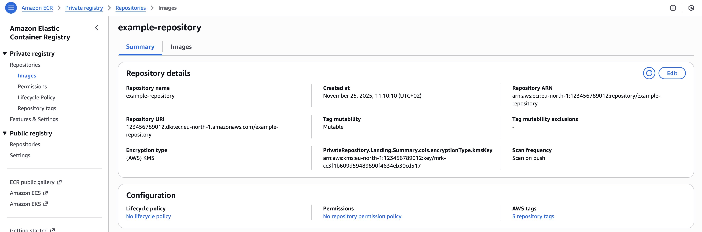

# Create a Repository

This is an example of how to create a Repository.

## 1. Create a Repository manifest

Create a Repository manifest and deploy it to the cluster.

It is a good practice to manage Repositories using GitOps methodology, similar to how applications are deployed.

By default, `metadata.name` is used as the repository name and no path (prefix) is used. Repository name and path can be overridden using `spec.name` and `spec.path` fields.

```yaml
# Example Repository: <aws-account>.dkr.ecr.<aws-region>.amazonaws.com/example-repository
apiVersion: artifact.entigo.com/v1alpha1
kind: Repository
metadata:
  name: example-repository
spec: {}

---
# Example Repository: <aws-account>.dkr.ecr.<aws-region>.amazonaws.com/helm/dev/example-repository-name-override
apiVersion: artifact.entigo.com/v1alpha1
kind: Repository
metadata:
  name: example-repository
spec:
  name: example-repository-name-override
  path: helm/dev

---
# Example Repository: <aws-account>.dkr.ecr.<aws-region>.amazonaws.com/helm/dev/example-repository
apiVersion: artifact.entigo.com/v1alpha1
kind: Repository
metadata:
  name: example-repository
spec:
  path: helm/dev

---
# Example Repository: <aws-account>.dkr.ecr.<aws-region>.amazonaws.com/example-repository-name-override
apiVersion: artifact.entigo.com/v1alpha1
kind: Repository
metadata:
  name: example-repository
spec:
  name: example-repository-name-override
```

## 2. Result

Repository created in Kubernetes

```yaml
$ kubectl get repository
NAME                 SYNCED   READY   COMPOSITION                        AGE
example-repository   True     True    repositories.artifact.entigo.com   3m13s
```

Repository created in AWS


