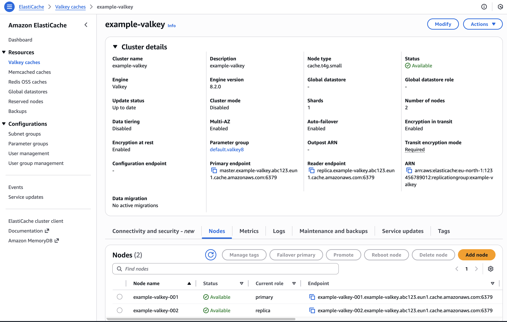
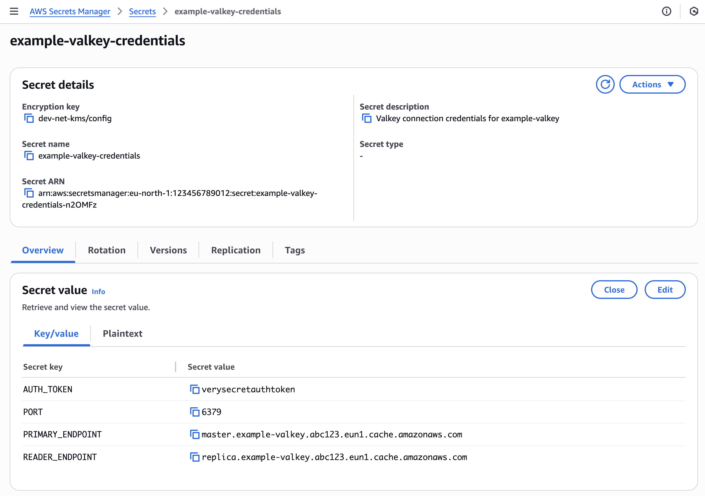

# Create a Valkey Instance

This is an example of how to create a Valkey instance.

## 1. Create a ValkeyInstance manifest

Create an ValkeyInstance manifest and deploy it to the cluster. It is a good practice to include it in the application's Helm chart.

Security group and security group rules which allow access to the ValkeyInstance from pods are created automatically.

```yaml
# Example ValkeyInstance
apiVersion: database.entigo.com/v1alpha1
kind: ValkeyInstance
metadata:
  name: example-valkey
spec: {}

---
# Example ValkeyInstance with deletion protection disabled
apiVersion: database.entigo.com/v1alpha1
kind: ValkeyInstance
metadata:
  name: example-valkey-no-deletion-protection
spec:
  deletionProtection: false

---
# Example ValkeyInstance with custom settings
apiVersion: database.entigo.com/v1alpha1
kind: ValkeyInstance
metadata:
  name: example-valkey-with-custom-settings
spec:
  deletionProtection: true
  engineVersion: '8.2'
  instanceType: 'cache.t4g.small'
  numCacheClusters: 3
  autoMinorVersionUpgrade: true
  maintenanceWindow: 'mon:00:00-mon:03:00'
  snapshotWindow: '05:00-06:00'
  snapshotRetentionLimit: 10
  parameterGroupName: 'default.valkey8'
```

## 2. Mount ValkeyInstance credentials to a container

Connection information for ValkeyInstance is stored in a Kubernetes secret and AWS Secrets Manager secret `<ValkeyInstance-name>-credentials`

For more information about Secrets in Kubernetes, see [Kubernetes documentation](https://kubernetes.io/docs/concepts/configuration/secret/).

```yaml
# Example 1
apiVersion: v1
kind: Pod
metadata:
  name: redis
spec:
  containers:
    - name: redis
      image: redis:alpine
      command: ['sleep', 'infinity']
      envFrom:
        - secretRef:
            name: example-valkey-credentials

---
# Example 2
apiVersion: v1
kind: Pod
metadata:
  name: redis
spec:
  containers:
    - name: redis
      image: redis:alpine
      command: ['sleep', 'infinity']
      env:
        - name: PRIMARY_ENDPOINT
          valueFrom:
            secretKeyRef:
              name: example-valkey-credentials
              key: PRIMARY_ENDPOINT
        - name: READER_ENDPOINT
          valueFrom:
            secretKeyRef:
              name: example-valkey-credentials
              key: READER_ENDPOINT
        - name: AUTH_TOKEN
          valueFrom:
            secretKeyRef:
              name: example-valkey-credentials
              key: AUTH_TOKEN
        - name: PORT
          valueFrom:
            secretKeyRef:
              name: example-valkey-credentials
              key: PORT

---
# Example 3
apiVersion: v1
kind: Pod
metadata:
  name: redis
spec:
  containers:
    - name: redis
      image: redis:alpine
      command: ['sleep', 'infinity']
      volumeMounts:
        - name: credentials
          mountPath: /etc/credentials
          readOnly: true
  volumes:
    - name: credentials
      secret:
        secretName: example-valkey-credentials
        items:
          - key: credentials.json
            path: credentials.json
```

## 3. Result

### 3.1 ValkeyInstance

ValkeyInstance created in Kubernetes

```yaml
$ kubectl get valkey
NAME             SYNCED   READY   COMPOSITION                           AGE
example-valkey   True     True    valkeyinstances.database.entigo.com   20m29s
```

Valkey instance created in AWS



### 3.2 Secret with connection information

Kubernetes secret with connection information

```yaml
~ kubectl get secret
NAME                         TYPE                                DATA   AGE
example-valkey-credentials   Opaque                              5      22m
```

```yaml
$ kubectl get secret example-valkey-credentials -o yaml
apiVersion: v1
kind: Secret
metadata:
  annotations:
    crossplane.io/composition-resource-name: credentials
  name: example-valkey-credentials
  namespace: <namespace>
type: Opaque
data:
  PRIMARY_ENDPOINT: <base64-encoded-primary-endpoint>
  READER_ENDPOINT: <base64-encoded-reader-endpoint>
  AUTH_TOKEN: <base64-encoded-auth-token>
  PORT: <base64-encoded-port>
  credentials.json: <base64-encoded-credentials>
```

AWS Secrets Manager secret with connection information



### 3.3 Secrets mounted to a container

```bash
# Example 1 and Example 2
$ env
PRIMARY_ENDPOINT=master.example-valkey.abc123.eun1.cache.amazonaws.com
READER_ENDPOINT=replica.example-valkey.abc123.eun1.cache.amazonaws.com
AUTH_TOKEN=verysecretauthtoken
PORT=6379

$ kubectl get pod
NAME    READY   STATUS    RESTARTS   AGE
redis   1/1     Running   0          10m

$ kubectl exec -it redis -- sh
/ export REDISCLI_AUTH="$AUTH_TOKEN"
/ redis-cli --tls -h "$PRIMARY_ENDPOINT" -p "$PORT" PING
PONG
/ redis-cli --tls -h "$PRIMARY_ENDPOINT" -p "$PORT" SET testkey "hello"
OK
/ redis-cli --tls -h "$PRIMARY_ENDPOINT" -p "$PORT" GET testkey
"hello"
```

```bash
# Example 3
$ cat /etc/credentials/credentials.json
{"AUTH_TOKEN": "verysecretauthtoken", "PORT": "6379", "PRIMARY_ENDPOINT": "master.example-valkey.abc123.eun1.cache.amazonaws.com", "READER_ENDPOINT": "replica.example-valkey.abc123.eun1.cache.amazonaws.com"}
```
