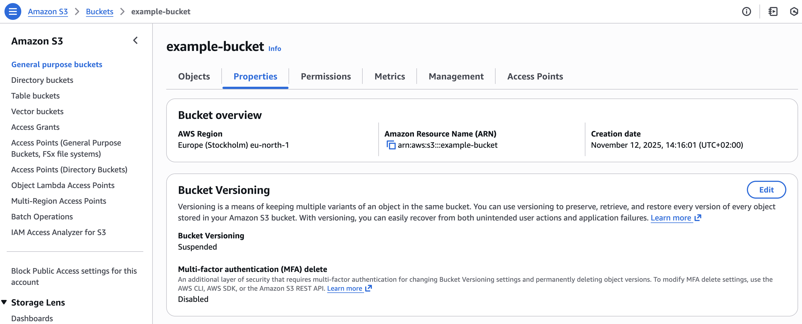
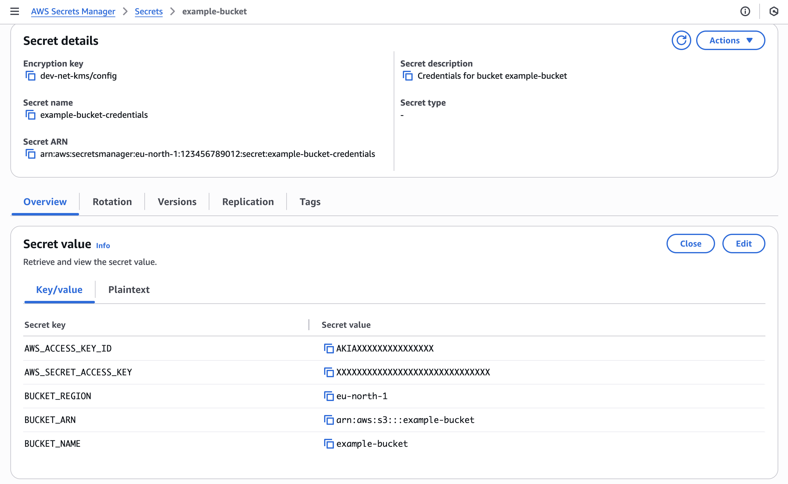

# Create an S3 bucket

This is an example of how to create an S3 bucket.

## 1. Create an S3Bucket manifest

Create an S3Bucket manifest and deploy it to the cluster. It is a good practice to include it in the application's Helm chart.

AWS IAM user, role and policy are automatically created with the S3Bucket.

```yaml
# Example S3Bucket manifest
apiVersion: storage.entigo.com/v1alpha1
kind: S3Bucket
metadata:
  name: example-bucket
spec:
  parameters: {}

---
# Example S3Bucket manifest with versioning enabled
apiVersion: storage.entigo.com/v1alpha1
kind: S3Bucket
metadata:
  name: example-bucket-with-versioning
spec:
  parameters:
    enableVersioning: true
```

## 2. Mount S3Bucket credentials to a container

IAM credentials and bucket information are stored in a Kubernetes secret and AWS Secrets Manager secret `<S3Bucket-name>-credentials`

For more information about Secrets in Kubernetes, see [Kubernetes documentation](https://kubernetes.io/docs/concepts/configuration/secret/).

```yaml
# Example 1
apiVersion: v1
kind: Pod
metadata:
  name: nginx
spec:
  containers:
    - name: nginx
      image: nginx:alpine
      ports:
        - containerPort: 80
      envFrom:
        - secretRef:
            name: example-bucket-credentials

---
# Example 2
apiVersion: v1
kind: Pod
metadata:
  name: nginx
spec:
  containers:
    - name: nginx
      image: nginx:alpine
      ports:
        - containerPort: 80
      env:
        - name: AWS_ACCESS_KEY_ID
          valueFrom:
            secretKeyRef:
              name: example-bucket-credentials
              key: AWS_ACCESS_KEY_ID
        - name: AWS_SECRET_ACCESS_KEY
          valueFrom:
            secretKeyRef:
              name: example-bucket-credentials
              key: AWS_SECRET_ACCESS_KEY
        - name: BUCKET_REGION
          valueFrom:
            secretKeyRef:
              name: example-bucket-credentials
              key: BUCKET_REGION
        - name: BUCKET_NAME
          valueFrom:
            secretKeyRef:
              name: example-bucket-credentials
              key: BUCKET_NAME
        - name: BUCKET_ARN
          valueFrom:
            secretKeyRef:
              name: example-bucket-credentials
              key: BUCKET_ARN

---
# Example 3
apiVersion: v1
kind: Pod
metadata:
  name: nginx
spec:
  containers:
    - name: nginx
      image: nginx:alpine
      ports:
        - containerPort: 80
      volumeMounts:
        - name: credentials
          mountPath: /etc/credentials
          readOnly: true
  volumes:
    - name: credentials
      secret:
        secretName: example-bucket-credentials
        items:
          - key: credentials.json
            path: credentials.json
```

## 3. Result

### 3.1 S3Bucket

S3Bucket created in Kubernetes

```yaml
$ kubectl get s3bucket
NAME                 SYNCED   READY   COMPOSITION                    AGE
example-bucket       True     True    s3buckets.storage.entigo.com   1h27m
```

S3 bucket created in AWS



### 3.2 Secrets with IAM credentials and bucket information

Kubernetes secret with IAM credentials and bucket information

```yaml
$ kubectl get secret
NAME                             TYPE                                DATA   AGE
example-bucket-credentials       Opaque                              6      1h20m
```

```yaml
$ kubectl get secret example-bucket-credentials -o yaml
apiVersion: v1
kind: Secret
metadata:
  annotations:
    crossplane.io/composition-resource-name: credentials
  labels:
    crossplane.io/composite: example-bucket
  name: example-bucket-credentials
  namespace: <namespace>
type: Opaque
data:
  AWS_ACCESS_KEY_ID: <base64-encoded-access-key>
  AWS_SECRET_ACCESS_KEY: <base64-encoded-secret-access-key>
  BUCKET_ARN: <base64-encoded-bucket-arn>
  BUCKET_NAME: <base64-encoded-bucket-name>
  BUCKET_REGION: <base64-encoded-bucket-region>
  credentials.json: <base64-encoded-credentials>
```

AWS Secrets Manager secret with IAM credentials and bucket information



### 3.3 Secrets mounted to a container

```yaml
$ env
AWS_ACCESS_KEY_ID=AKIAXXXXXXXXXXXXXXX
AWS_SECRET_ACCESS_KEY=XXXXXXXXXXXXXXXXXXXXXXXXXXXXXXXXXX
BUCKET_ARN=arn:aws:s3:::example-bucket
BUCKET_NAME=example-bucket
BUCKET_REGION=eu-north-1
```

```
$ cat /etc/credentials/credentials.json
{"AWS_ACCESS_KEY_ID": "AKIAXXXXXXXXXXXXXXX", "AWS_SECRET_ACCESS_KEY": "XXXXXXXXXXXXXXXXXXXXXXXXXXXXXXXXXX", "BUCKET_REGION": "eu-north-1", "BUCKET_ARN": "arn:aws:s3:::example-bucket", "BUCKET_NAME": "example-bucket"}
```
