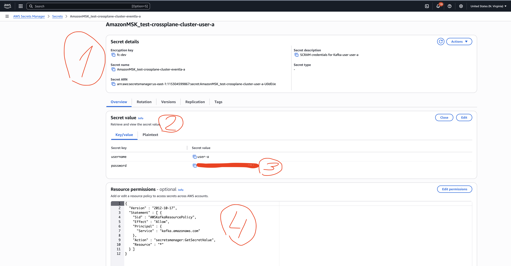
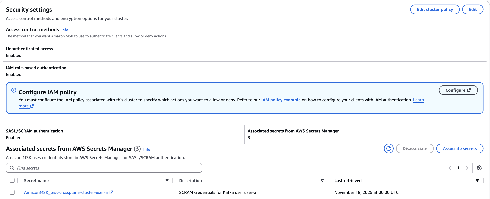
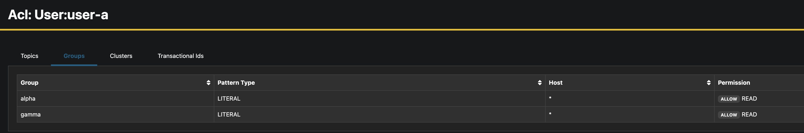
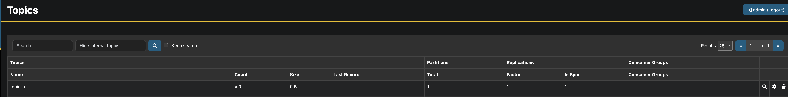
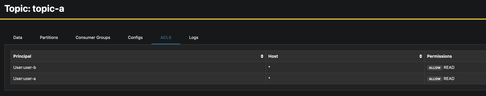

# Manage Kafka (MSK) Users, Topics and ACL's

This is an example of how to manage MSK Users, Topics and user ACL's via Crossplane.

## 0. Prerequisites

Have an existing MSK cluster (currently the CRD's do not create or manage the MSK cluster itself) with IAM authentication enabled.

Have Crossplane installed via Infralib (we are using an IRSA role created via the Infralib Crossplane module to connect to the MSK cluster).

Have Crossplane observed objects turned on (need the KMS key created via Infralib to create SM secret).

## 1. Create an Observed MSK cluster object

Create an Observed MSK manifest and deploy it to the cluster.

This also creates a ProviderConfig in the background to be used for the Kafka provider that manages ACL's and Topics.

```yaml
# Example Observed MSK object
apiVersion: kafka.entigo.com/v1alpha1
kind: MSK
metadata:
  name: test-crossplane-cluster
spec:
  clusterARN: "arn:aws:kafka:{region}:{account}:cluster/{msk-cluster-name}/{uuid}"
  namespace: default
```

## 2. Create a Kafka User (with consumer group acl's)

Create an Kafka User manifest and deploy it to the cluster.

```yaml
---
apiVersion: kafka.entigo.com/v1alpha1
kind: KafkaUser
metadata:
  name: user-a
  namespace: default
spec:
  clusterName: test-crossplane-cluster
```

This creates:

* A kubernetes secret (generates a password for the Kafka user)
* an AWS SM (Secret Manager) secret
* SM Secret Policy
* SM Secret Version
* MSK Scram Secret Association

If `spec.consumerGroups.` is defined, the composition also creates consumer group ACL's for the created users.

```yaml
apiVersion: kafka.entigo.com/v1alpha1
kind: KafkaUser
metadata:
  name: user-b
  namespace: team-b
spec:
  clusterName: test-crossplane-cluster
  consumerGroups:
    - alpha
    - gamma
```

## 3. Create a Kafka Topic (with topic acl's)

Create an Kafka Topic manifest and deploy it to the cluster.

```yaml
apiVersion: kafka.entigo.com/v1alpha1
kind: Topic
metadata:
  name: topic-a
  namespace: team-a
spec:
  clusterName: test-crossplane-cluster
  partitions: 1
  replicationFactor: 1
  config:
    retention.ms: "604800012"
  acls:
    - principal: user-a
      operation: Read
    - principal: user-b
      operation: Read
```

This creates:

* A Kafka Topic
* ACL's for the defined users

## 3. Result

### 3.1 Observed Kafka Cluster

Observed MSK created in Kubernetes

```yaml
[~]# kubectl get msk
NAME                               SYNCED   READY   COMPOSITION    AGE
test-crossplane-cluster-observed   True     True    msk-observed   7d
```

### 3.2 Kafka User

Kafka User objects created in Kubernetes

```yaml
[~]# kubectl get KafkaUser
NAME                          SYNCED   READY   CONNECTION-SECRET   AGE
user-a                        True     True                        18h

[~]# kubectl get secret
NAME                                                      TYPE     DATA   AGE
test-crossplane-cluster-user-a-k8s                        Opaque   1      18h


[~]# kubectl get secret.secretsmanager.aws.upbound.io
NAME                                                  SYNCED   READY   EXTERNAL-NAME                                                                                    AGE
test-crossplane-cluster-user-a                        True     True    arn:aws:secretsmanager:us-east-1:xxxxxxxxxxxx:secret:AmazonMSK_test-cluster-name-user-a-U0dDJe   18h

[~]# kubectl get secretpolicy.secretsmanager.aws.upbound.io
NAME                                                        SYNCED   READY   EXTERNAL-NAME                                                                                    AGE
test-crossplane-cluster-user-a-policy                       True     True    arn:aws:secretsmanager:us-east-1:xxxxxxxxxxxx:secret:AmazonMSK_test-cluster-name-user-a-U0dDJe   18h

[~]# kubectl get secretversion.secretsmanager.aws.upbound.io
NAME                                                         SYNCED   READY   EXTERNAL-NAME   AGE
test-crossplane-cluster-user-a-version                       True     True                    18h

[~]# kubectl get accesscontrollists
NAME              READY   SYNCED   EXTERNAL-NAME                                                                                                                                                                                            AGE
user-a-alpha-cg   True    True     {"ResourceName":"alpha","ResourceType":"Group","ResourcePrincipal":"User:user-a","ResourceHost":"*","ResourceOperation":"Read","ResourcePermissionType":"Allow","ResourcePatternTypeFilter":"Literal"}   18h
user-a-gamma-cg   True    True     {"ResourceName":"gamma","ResourceType":"Group","ResourcePrincipal":"User:user-a","ResourceHost":"*","ResourceOperation":"Read","ResourcePermissionType":"Allow","ResourcePatternTypeFilter":"Literal"}   18h
```

AWS Secrets Manager secret with IAM credentials, secret scram association and consumer group ACL's



1. SM Secret
2. SM Secret Version
3. SM Secret Version password (taken from generated k8s Secret)
4. SM Secret Policy



Secret Scram association



User Consumer Group ACL's

### 3.3 Kafka Topic

Kafka Topic objects created in Kubernetes

```yaml
[~]# kubectl get Topic -A
NAMESPACE   NAME      SYNCED   READY   CONNECTION-SECRET   AGE
team-a      topic-a   True     True                        19h

[root@ip-10-201-0-207 ~]# kubectl get topic.topic.kafka.crossplane.io
NAME                                 READY   SYNCED   EXTERNAL-NAME                        AGE
topic-a                              True    True     team-a                               19h

[root@ip-10-201-0-207 ~]# kubectl get accesscontrollist.acl.kafka.crossplane.io
NAME                  READY   SYNCED   EXTERNAL-NAME                                                                                                                                                                                                AGE
topic-a-user-a-read   True    True     {"ResourceName":"topic-a","ResourceType":"Topic","ResourcePrincipal":"User:user-a","ResourceHost":"*","ResourceOperation":"Read","ResourcePermissionType":"Allow","ResourcePatternTypeFilter":"Literal"}     19h
topic-a-user-b-read   True    True     {"ResourceName":"topic-a","ResourceType":"Topic","ResourcePrincipal":"User:user-b","ResourceHost":"*","ResourceOperation":"Read","ResourcePermissionType":"Allow","ResourcePatternTypeFilter":"Literal"}     19h
```

Kafka Topic objects in Kafka



Kafka Topic in AKHQ



Kafka Topic ACL's for User in AKHQ