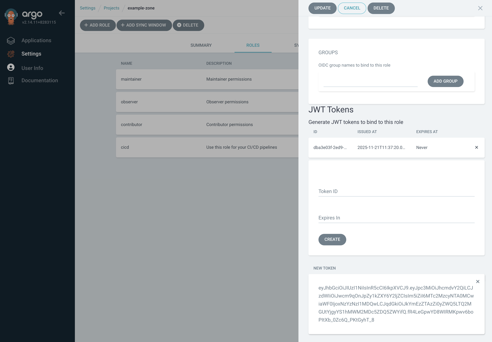
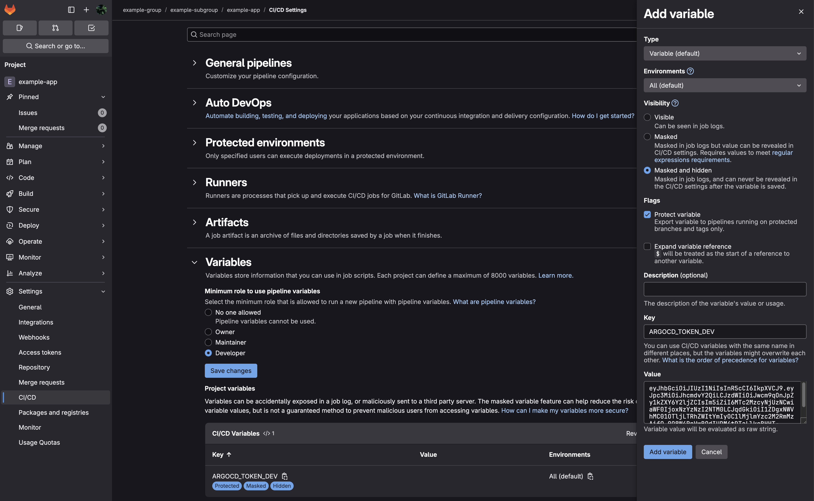

# GitLab CI - ArgoCD authentication

This is an example of how to create a JWT token in ArgoCD and use it in GitLab CI to deploy applications in ArgoCD.

For more information about authentication in ArgoCD, see [ArgoCD documentation](https://argo-cd.readthedocs.io/en/stable/operator-manual/security/#authentication).

### 1.Requirements

[Zone](https://docs.entigo.com/docs/guides/create-a-zone)

### 2. Create a JWT token in ArgoCD

`Settings` -> `Projects` -> `<project-name>` -> `Roles` -> `cicd` -> `Create (under JWT Tokens)`

Copy the token value.



### 3. Create a secret in GitLab using the token

`Settings` -> `CI/CD` -> `Variables` -> `Add variable`

Type: `Variable`

Visibility: `Masked and hidden`

Flags: `Protect variable`

Key: `ARGOCD_TOKEN_<ENV>`

Value: `<token-value>`

Click `Add variable`



### 4. Create a GitLab CI pipeline and use the token

```yaml
# .gitlab-ci.yml

variables:
  ARGOCD_HOST_DEV: argocd.dev.example.com
  KUBERNETES_NAMESPACE: example-namespace

workflow:
  rules:
    - when: always

stages:
  - requirements
  - build
  - deploy

requirements-variables:
  stage: requirements
  script: |
    ...

requirements-helm:
  stage: requirements
  script: |
    ...

requirements-docker:
  stage: requirements
  script: |
    ...

build-image:
  stage: build
  script: |
    ...

build-chart:
  stage: build
  script: |
    ...

dev:
  stage: deploy
  variables:
    ARGOCD_TOKEN: ${ARGOCD_TOKEN_DEV}
    ARGOCD_HOST: ${ARGOCD_HOST_DEV}
  extends: .deploy
  needs:
    - job: requirements-variables
    - job: build-image
      optional: true
    - job: build-chart

.deploy:
  script: |
    ...
    APP_NAME=example-app
    argocd --server "${ARGOCD_HOST}" --auth-token="${ARGOCD_TOKEN}" app get --refresh ${KUBERNETES_NAMESPACE}/$APP_NAME
    argocd --server "${ARGOCD_HOST}" --auth-token="${ARGOCD_TOKEN}" app diff --exit-code=false ${KUBERNETES_NAMESPACE}/$APP_NAME
    argocd --server "${ARGOCD_HOST}" --auth-token="${ARGOCD_TOKEN}" app sync ${KUBERNETES_NAMESPACE}/$APP_NAME
    argocd --server "${ARGOCD_HOST}" --auth-token="${ARGOCD_TOKEN}" app wait --timeout 300 --health --sync --operation ${KUBERNETES_NAMESPACE}/$APP_NAME
```
